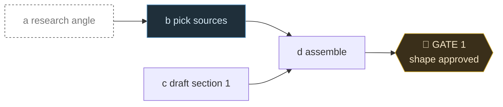

# Planning

Plan work as a directed acyclic graph before doing it. The agent proposes, you
approve, then execution runs. This skill never runs a crew solo.

## Roles

Five fixed names, used across this skill, AGENTS.md, and plan files:

1. **Explorer** - figure out what the task really is. Skip once the ask is clear.
2. **Planner** - shape branchy work into a DAG and stop at Gate 1. Trivial or
   linear work passes straight through.
3. **Worker** - run nodes in topological order.
4. **Critic** - verify each node, cheapest deterministic check first.
5. **Promoter** - decide if verified work is worth showing off; most is not.

No aliases like "research phase" or "promote step."

## When to use

Work that branches, rejoins, or has dependencies between pieces. Skip trivial or
linear tasks - planning has a cost.

## Core rule

Nodes are units of work, edges are dependencies. Build the graph, check in at
each gate, and never self-run the whole DAG.

## Process

### 1. Planner - build the DAG

- One node per unit of work: id, one-line goal, effort (cheap/medium/expensive).
- Edges only where one node depends on another. No cycles - a cycle means the
  plan is muddled.
- Split anything that would become a paragraph to describe.

### 2. Planner - render the DAG

**Use Mermaid**, so it renders in Obsidian, GitHub, and editors:

````

````

Node ids lead the label (`a1`, `b3`) so the table can refer to them. Gates use
the `{{...}}` hexagon and the `gate` classDef. Keep labels to a few words and put
effort in the table, not the graph.

Before showing a DAG in chat, run `bin/mermaid-fit.js <file>`. Pi's feed shows
the raw fence when a diagram is wider than the pane; shorten labels until it
passes.

**Status is color plus emoji**, so it reads in any renderer and in plain text:

| Status      | Emoji | classDef                |
| ----------- | ----- | ----------------------- |
| done        | ✅    | `done` (dimmed, dashed) |
| in progress | 🔄    | `active` (blue)         |
| blocked     | ⛔    | `blocked` (red)         |
| not started | none  | default                 |
| gate        | 🚦    | `gate` (amber)          |

The emoji leads the label (`"✅ a1 research angle"`) and matches the node's
`class` line. Update both as work moves. Finished work dims so the eye lands on
what is left.

**The node list dims too.** A finished row's id is struck through,
`| ~~a1~~ ✅ |`. Markdown renders that as `<del>`, so any viewer dims the
whole row with `tr:has(del) { opacity: 0.45 }` and GitHub shows it crossed
out. One line above the table names the legend.

ASCII only for a throwaway sketch that will never persist.

**Put the DAG in a plan file.** `plans/<plan>.md`, or a companion
`plans/<plan>.plan.md` if that file should stay pure spec. One file per plan.
Gate decisions land in Decisions as one-liners, nowhere else.

### 3. Planner - keep it readable

Word bloat is the nemesis. Judge every line: **does this change a decision, or
could the code say it?** If neither, cut it. A plan over ~120 lines has absorbed
something - find it and delete it.

Write ideas, not explanations: one idea per line, seven to ten words where
possible. The reader knows what to do; no instructions addressed to them, no
hedges, no reasoning they did not ask for.

Open with who it is for: one sentence naming the target customer, so every
node can be judged against them.

Carries: decisions and what was rejected, one line each. Open questions, as
questions. What to do next and how to judge it. What the code cannot say -
gotchas that bite, why the thing exists at all.

Does not carry:

- A changelog. Git holds history. No dated "what changed" list, no gate log, no
  "approved on" section, no restating how the plan got here.
- Settled questions. Move the decision to Decisions and delete the question.
- Nodes a decision absorbed. When a branch is picked, the choosing node
  disappears and the choice stands alone.

Finished nodes stay, dimmed, until the human says to prune. Pruning removes
the node, its edges, its row, and any mention elsewhere. Never prune on your
own.

- A decision explained twice - as a bullet, then prose, then a rationale
  paragraph. Or a rejected option kept as its own paragraph.
- Restated docstrings or how a function works inside.
- Prose explaining a command.

Trim words on the way out of a session, not later. Say what you cut. See the
`readable` skill for the sentence-level pass.

### 4. Gate 1 - approve the shape

Present the rendered DAG and order. Ask one question: is the shape right? Only
topology counts - added, removed, or merged nodes, wrong dependencies, wrong
order. Wait for the go before executing. Revise and re-present if wrong. Record
the outcome as a Decisions line, not a gate log.

### 5. Worker - execute

Topological order, dependencies first, parallel where independent.

Plain execution is the default. A node that iterates toward a measurable target
runs as an autoresearch loop; there are no subagents.

### 6. Critic - verify

Apply the `critic` skill after each node or merge point. If a node changes the
shape of later work, stop and check in before the next gate.

### 7. Promoter - when it earns it

Triggers: a feature genuinely worth showing off, or docs good enough to show.
Channels are YouTube, TikTok, and `About.vue`; motion graphics preferred (see
`hyperframes`). Promoter nodes gate on the feature being verified, and the human
approves before it ships. Most nodes skip this.

### 8. Gate 2

Summarize what ran. Ask whether it meets the plan. Done is your call.

## Human in the loop

- Every gate pauses. No autonomous crew run.
- One question at a time; no question bombs.
- A node that would change the shape mid-run means stop and re-present.
- Underspecified task? Ask before building the DAG, not after.

## Related

- `critic` - the Critic role.
- `project-tooling` - read a project's scripts before planning work inside it.
- `skill-finder` - when a node needs a capability you lack.
- `hyperframes` - motion graphics for the Promoter role.

## Source

- "Building an Advanced Agentic Harness" (data4sci, 2026-07-15), clipped to
  the vault at `Clippings/Building an Advanced Agentic Harness.md`.
- "The Harness Is the Thing" -
  <https://scott-fryxell.github.io/blog/the-harness-is-the-thing/>
